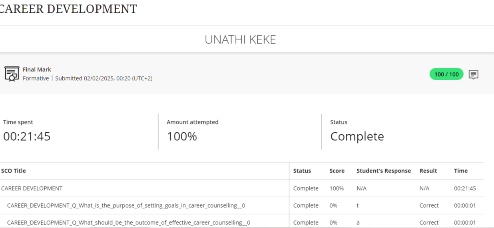

### 👋 WELCOME

Welcome to my digital portfolio! This is a summary of my achievements and skills from the Work Readiness Training program.

---

## 💼 *Work Readiness Training*

1. CAREER COUNSELLING
- EVIDENCE
  *  
- REFLECTION: 
2. SKILLS AND INTERESTS
- EVIDENCE 
- REFLECTION:
3. PERSONALITY ASSESSMENT
- EVIDENCE 
- REFLECTION:
4. CREATE A CV
- EVIDENCE 
- REFLECTION: 
5. CV SUBMISSION
- EVIDENCE
- REFLECTION:

---

## 🔧 Skills

- Communication & Presentation
- Microsoft Office Suite
- Time Management
- Problem Solving
- Remote Collaboration Tools (Zoom, Blackboard, Teams)

---

## 📁 Projects

### 📚 Team Project: Career Skills Presentation
- Collaborating with a team of 5 to develop an e-commerce platform selling brain boost shots from a well known company called Sir. Inc
* R12,50c for a 100ml bottle 
* Ranges up to R150 for a pack of 12 shots. 
- Languages used: Html, Css, Javascript 

### 🧠 Mock Interview Challenge
- Simulated interviews with industry professionals
- Received detailed feedback and improved delivery

---

## 📫 Contact

- Send me an email : keke.ac.za.cput@gmail.com
- GitHub account : [@my-portfolio](https://github.com/Una221410848/my-portforlio/blob/main/README.md?plain=1)

---

~THE END~
