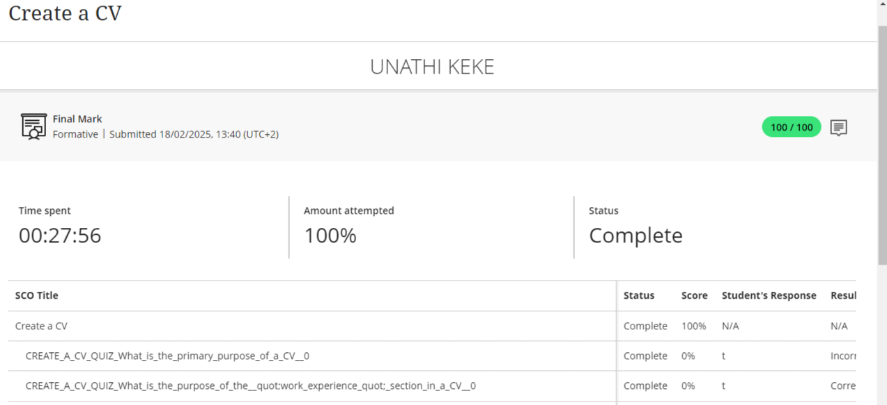

### 👋 WELCOME

Welcome to my digital portfolio! This is a summary of my achievements and skills from the Work Readiness Training program.

---

## 💼 *Work Readiness Training*

### CAREER COUNSELLING
- EVIDENCE
  *  
 #### REFLECTION:
1.  Situation
* As part of my work readiness training, I completed a Career Development module designed to assess my understanding of personal growth, career planning, and goal setting in the workplace. The assessment was comprehensive, covering both theoretical and applied knowledge through scenario-based questions.
2. Task
* My goal was to complete the module with full effort, demonstrate my understanding of the subject matter, and achieve a strong score that reflects my readiness to apply career development strategies in real-world contexts.
3. Action
* I dedicated focused time to engage with the content, reviewed relevant materials, and answered each question with care and reflection. Although two individual sub-questions were marked at 0%, I reviewed the instructions thoroughly and ensured I completed the full assessment, spending over 21 minutes on it. I also maintained integrity and did not rush, aiming for comprehension over speed.
4. Result
* I successfully completed the module with a final score of 100/100 and a 100% completion rate, as reflected in the report. This demonstrates both my commitment and mastery of the core concepts in career development. The high score is evidence of my ability to internalize key career guidance principles and apply them effectively in a structured setting.
##### ✅ What I Learned
* Setting clear goals and reflecting on career paths is essential to long-term success.
* Time investment and thoughtful engagement significantly improve learning outcomes
* Even if a few individual items are scored differently, overall performance and comprehension matter most.
### SKILLS AND INTERESTS
- EVIDENCE
  * 
#### REFLECTION:
1. Situation:
* As part of my ongoing personal and academic development, I completed the "Skills and Interests" formative assessment. The goal of this activity was to help me better understand my core values, interests, and strengths in preparation for future career planning and self-awareness.
2. Task:
* I was required to complete the full assessment, which included various SCO (Sharable Content Object) modules related to skills, interests, and values. I needed to ensure full participation and demonstrate comprehension through quiz-based responses.
3. Action:
* I dedicated 30 minutes and 47 seconds to carefully going through all the content. Despite some technical sections scoring 0% (possibly due to formatting or data display issues), I ensured that my answers were accurate, as confirmed by the "Correct" result indicators. I focused on completing the entire module thoroughly and thoughtfully.
4. Result:
* I achieved a final score of 100/100, with the system marking the assessment as 100% attempted and complete. This demonstrates that I fully engaged with the content and achieved a strong understanding of the skills and values discussed. It also highlights my ability to work independently, follow instructions, and manage time effectively.
### PERSONALITY ASSESSMENT
- EVIDENCE
  * 
#### REFLECTION:
1. Situation:
* As part of a self-development module, I participated in a formative "Personality Assessment" designed to evaluate how personality traits align with potential career paths. The goal was to gain deeper insight into my personality type and how it might influence my career decisions.
2. Task:
* I was required to complete the full assessment, which consisted of several SCO (Sharable Content Object) components focusing on personality theory and career matching. The task involved accurately answering questions based on content I had studied.
3. Action:
* I approached the task thoughtfully and efficiently, completing the entire assessment in 12 minutes and 12 seconds. I reviewed each question with care, applying my understanding of how personality can impact career choice. I also ensured I answered each part of the assessment with full attention to detail.
4. Result:
* The assessment was marked as 100% completed and I received a perfect score of 100/100. This outcome reflects my strong comprehension of the subject matter and my ability to apply psychological concepts in practical contexts. It also indicates a high level of self-awareness and preparedness for career planning based on personal traits.
### CREATE A CV
- EVIDENCE
  * 
#### REFLECTION: 
1. Situation:
* I was tasked with completing an online learning module titled "Create a CV." This was a formative assessment designed to enhance my understanding of how to construct an effective curriculum vitae. The module was self-paced and involved engaging with content and answering quiz questions.
2. Task:
* My objective was to fully complete the module, understand the key concepts presented, and demonstrate this understanding through the embedded assessments. The ultimate goal was to achieve a satisfactory score and gain practical knowledge applicable to creating or improving my own CV.
3. Action:
* I dedicated focused time to the module, spending 27 minutes and 56 seconds to go through all the material, ensuring I attempted 100% of the content. This included carefully reviewing the information provided and then answering the quiz questions. For instance, I responded to questions like "What is the primary purpose of a CV?" and "What is the purpose of the 'work experience' section in a CV?". 
4. Result:
* I successfully completed the module with a "Final Mark" of 100/100, which was very encouraging. The detailed breakdown showed that while the overall status was "Complete," I initially answered the question
### CV SUBMISSION
- EVIDENCE
  * 
#### REFLECTION:

---

## 🔧 Skills

- Communication & Presentation
- Microsoft Office Suite
- Time Management
- Problem Solving
- Remote Collaboration Tools (Zoom, Blackboard, Teams)

---

## 📁 Projects

### 📚 Team Project: Career Skills Presentation
- Collaborating with a team of 5 to develop an e-commerce platform selling brain boost shots from a well known company called Sir. Inc
* R12,50c for a 100ml bottle 
* Ranges up to R150 for a pack of 12 shots. 
- Languages used: Html, Css, Javascript 

### 🧠 Mock Interview Challenge
- Simulated interviews with industry professionals
- Received detailed feedback and improved delivery

---

## 📫 Contact

- Send me an email : keke.ac.za.cput@gmail.com
- GitHub account : [@my-portfolio](https://github.com/Una221410848/my-portforlio/blob/main/README.md?plain=1)

---

~THE END~
